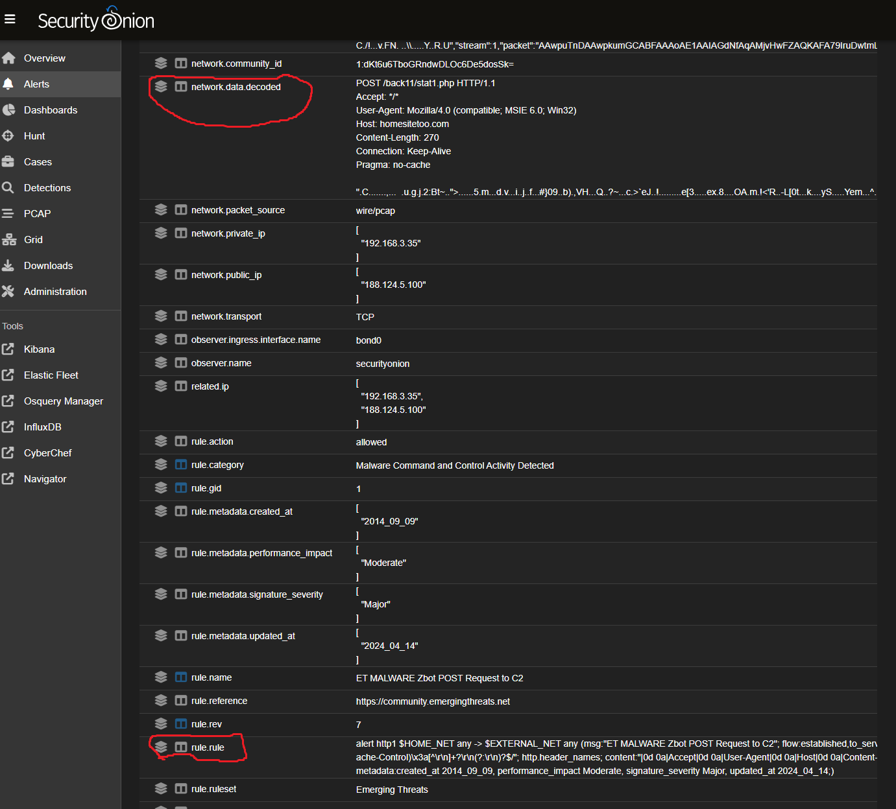
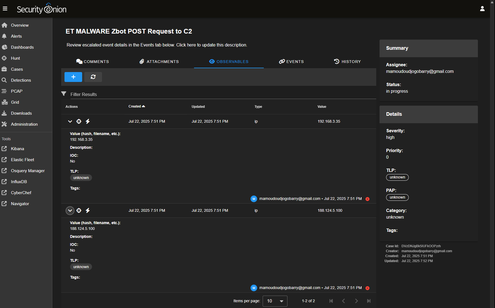
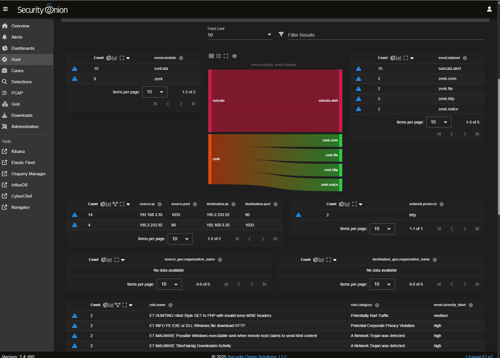
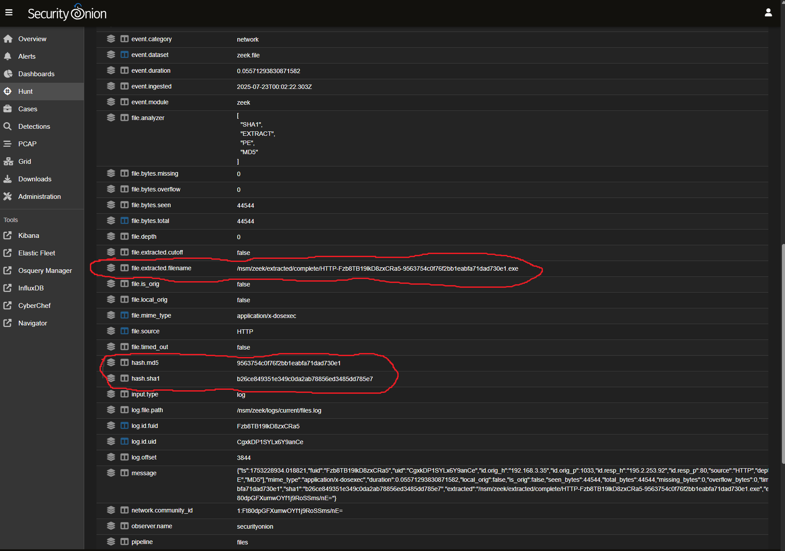
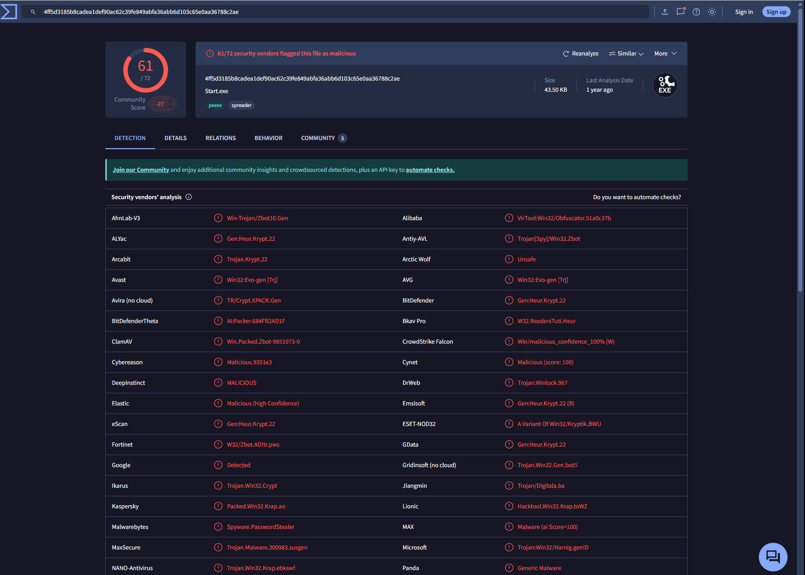

# 🛡️ Alert Triage & Case Management Lab

This project simulates an enterprise-grade Security Operations Center (SOC) workflow using **Security Onion** for alert triage and case management, and **Elastic Stack (Kibana)** for threat detection and visualization.

The goal is to detect, investigate, and respond to simulated malicious activity in a structured, realistic way—mirroring professional SOC operations.

---

## 🎯 Objectives

- 📥 Simulate enterprise-level malicious activity
- 🔐 Detect and visualize alerts in Security Onion and Kibana
- 🔎 Investigate, triage, and correlate indicators of compromise (IoCs)
- 🧪 Create and manage incident cases based on real workflows

---

## 🛠️ Tools & Technologies

- **Security Onion**: Alert triage, case management, hunting
- **Elastic Stack (Kibana)**: Visual dashboards
- **Suricata & Zeek**: Network detection and logging
- **VirusTotal**: Threat intel for file hash validation

---

## 📊 Alert Overview

### Kibana Dashboard


> Kibana showed **57 high-severity alerts** within the last 2 hours, indicating active malicious behavior.

---

### Security Onion Alerts


Security Onion confirmed the presence of multiple high-priority alerts, including potential malware activity and unusual file downloads.

---

## 🔎 Investigation Walkthrough

### Initial Alert: Zbot C2 Communication



- **Alert**: `ET MALWARE Zbot POST Request to C2`
- **Behavior**: Attempted outbound HTTP POST to `homesitetoo.com`
- **Action**: Created case and began gathering IoCs

---

### Case Management



- Created a case for IP `192.168.3.35`
- Collected domains, source/destination IPs, and timestamps
- Used Hunt tool to track down related alerts

---

### File Download & Correlation



- Alert: `ET INFO PE EXE or DLL Windows file download HTTP`
- Decoded data showed EXE downloaded over HTTP
- Used `community_id` to correlate with Zeek and HTTP data

---

### Zeek File Analysis



- Discovered downloaded file and hash values (MD5/SHA1)
- Added observables to the incident case

---

### VirusTotal Hash Verification



- Both hashes flagged as malicious
- Confirmed file as part of a malware campaign

---

## ✅ Incident Summary

- **Host**: Windows machine
- **IP Address**: `192.168.3.35`
- **Threat Type**: Malware infection
- **Evidence**: C2 communication, malicious file download, VirusTotal confirmation

---

## 🧪 Recommendations

- 🛑 Immediately isolate the infected host from the network
- 🧼 Reimage system to remove persistent malware
- 🔐 Patch, scan, and harden system before reconnecting
- 🧠 Review firewall rules and deploy EDR across environment

---

## 📁 Folder Structure

```bash
Alert-Triage-Lab/
├── README.md
├── images/
│   ├── Kibana-dashboard.png
│   ├── SecOnion-alert.png
│   ├── rule-alert.png
│   ├── case.png
│   ├── corelated-dashboard.png
│   ├── zeek.png
│   └── virustotal.png
└── cases/
    └── case-192.168.3.35.md
