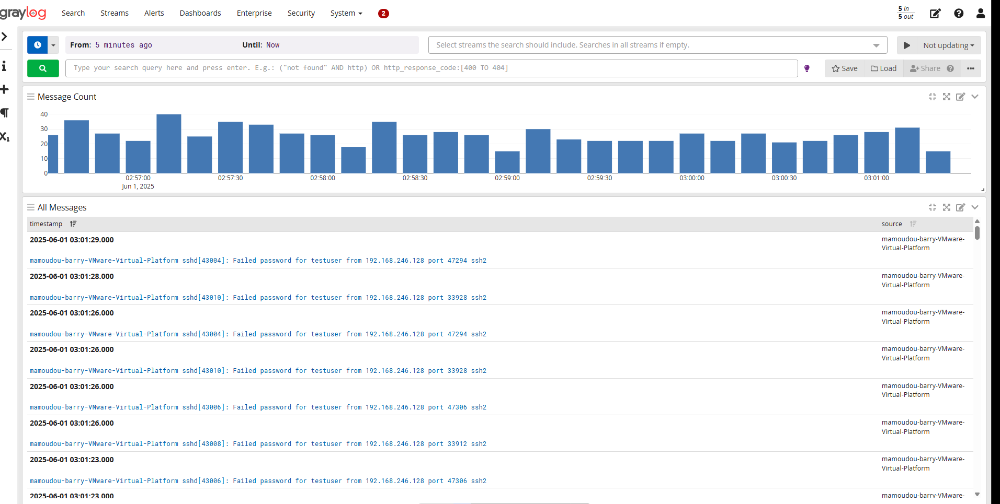
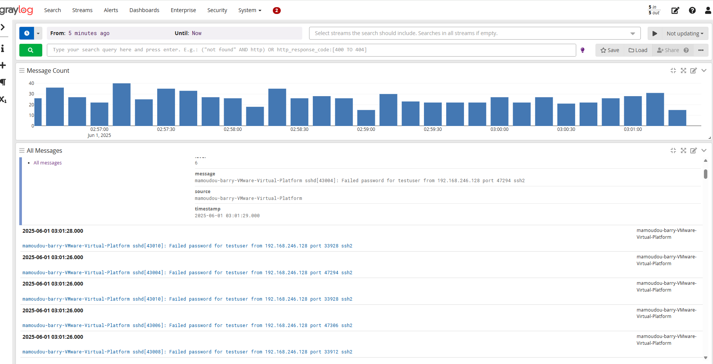

# 🛡️ Centralized Log Monitoring & Threat Detection

This project showcases a real-world simulation of centralized log collection and analysis using **Graylog SIEM** in a home lab environment. Logs from **Ubuntu**, **Windows 10**, and **pfSense** are forwarded to Graylog and used to detect brute-force attacks and unauthorized access attempts.

---

## 📌 Objective

Build a centralized monitoring system to:
- Detect brute-force SSH login attempts
- Analyze logs from multiple endpoints in real time
- Simulate attacker behavior using tools like `hydra` from Kali Linux
- Visualize and respond to events using **Graylog dashboards**

---

## 🧰 Tools & Technologies

- **Graylog** (installed on Ubuntu VM)
- **Syslog & SSH Logs** from Ubuntu
- **NxLog + Sysmon** on Windows 10
- **pfSense Logs** (firewall + system)
- **Hydra** (brute-force tool from Kali)
- **Log Format**: Syslog and GELF (Graylog Extended Log Format)

---

## 🧪 Lab Architecture

| VM | Role | Notes |
|----|------|-------|
| Ubuntu | Graylog SIEM + rsyslog | Receives logs |
| Windows 10 | Log source | Configured with NxLog + Sysmon |
| Kali Linux | Attacker | Launches brute-force and scans |
| pfSense | Firewall + IDS | Forwards logs to Graylog via syslog |

---

## 🔍 Scenario: Detect SSH Brute-Force from Kali

1. **Attack Simulation**
   - From Kali Linux:
     ```bash
     hydra -l testuser -P /usr/share/wordlists/rockyou.txt ssh://<ubuntu-ip>
     ```
   - Hydra attempts multiple passwords over SSH, triggering failed login attempts.

2. **Log Forwarding**
   - Ubuntu logs sent via rsyslog to Graylog (UDP port 514)
   - Messages include:
     ```
     sshd[43229]: Failed password for testuser from 192.168.246.128 port 41380 ssh2
     ```

3. **Detection in Graylog**
   - Query used:
     ```
     message:"Failed password" AND source:mamoudou-barry-VMware-Virtual-Platform
     ```
   - Visualized on Graylog with histogram of login failures

4. **Log Message Example**
   ### 🔸 Login Failure Logs


### 🔸 Graylog Log Message Details


