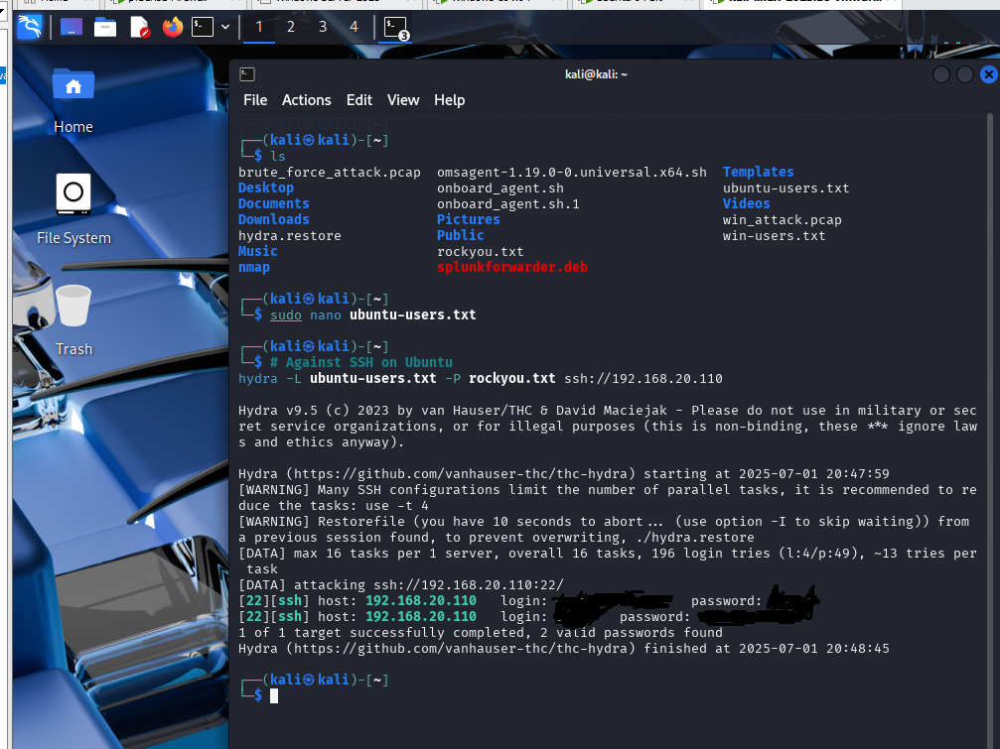
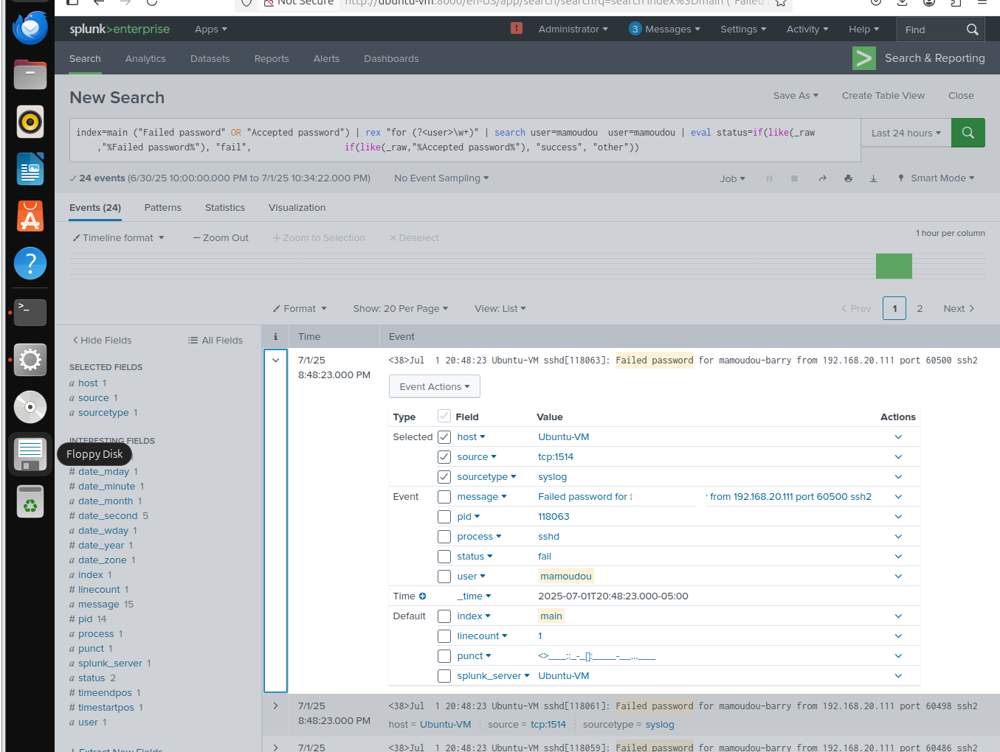
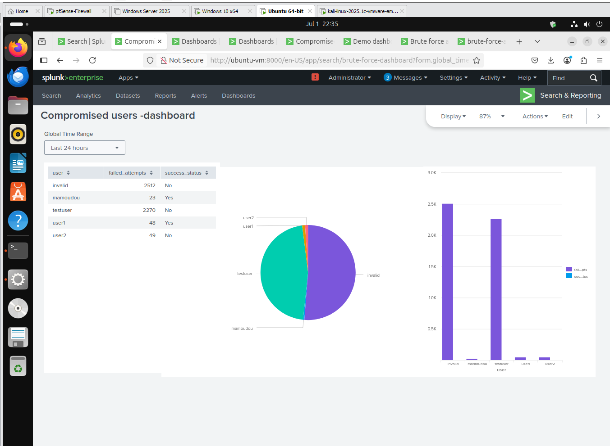

# 🛡️ Centralized Log Monitoring & Threat Detection with Splunk

This project simulates an enterprise-level Security Operations Center (SOC) using **Splunk Enterprise** as the centralized log monitoring platform. Logs from **Ubuntu**, **Windows 10**, and **pfSense** are collected and analyzed to detect brute-force attacks and unauthorized access attempts. The attacker machine uses **Kali Linux** and the `hydra` tool to perform SSH brute-force attempts.

---

## 🎯 Objectives

- 📥 Centralize log collection from multiple operating systems and firewall
- 🔐 Detect brute-force SSH login attempts
- 🔎 Correlate and analyze logs from multiple systems
- 🧪 Simulate real-world attacker behavior
- 📊 Visualize threats using Splunk dashboards

---

## 🧰 Tools & Technologies

| Tool / Tech        | Purpose                                 |
|--------------------|-----------------------------------------|
| **Splunk Enterprise** | SIEM for log collection & analysis     |
| **Ubuntu**         | Log source + Splunk deployment          |
| **Windows 10**     | Log source with **Sysmon** + **NxLog**  |
| **pfSense**        | Network firewall and log forwarder      |
| **Kali Linux**     | Attacker machine with **Hydra**         |
| **Syslog / JSON**  | Log formats for ingestion               |

---

## 🗺️ Lab Architecture

| VM           | Role                      | Description                                |
|--------------|---------------------------|--------------------------------------------|
| **Ubuntu**   | Splunk Server + Log Source | Hosts Splunk; collects syslog and SSH logs |
| **Windows 10** | Endpoint                  | Sends Sysmon and security logs via NxLog   |
| **Kali Linux** | Attacker                  | Launches brute-force SSH attacks           |
| **pfSense**  | Firewall + IDS (optional Suricata) | Sends system + firewall logs         |

---

## 🔐 Threat Simulation: SSH Brute-Force Attack

### 1️⃣ Launch Attack from Kali

From Kali Linux, use Hydra to simulate SSH brute-force:

```bash
hydra -l testuser -P /usr/share/wordlists/rockyou.txt ssh://<ubuntu-ip>
```

- This command tries multiple passwords over SSH.
- It triggers failed login attempts on the Ubuntu server.

---

### 2️⃣ Log Collection

#### ✅ Ubuntu Logging

- Ubuntu forwards logs using `rsyslog` to Splunk (TCP port `1514`).
- Example SSH log entry:

```log
sshd[118063]: Failed password for testuser from 192.168.20.111 port 60500 ssh2
```

#### ✅ Windows Logging

- Windows 10 uses **Sysmon** and **NxLog** to send event logs in JSON format.
- Logs include process creation, logon events, and network connections.

#### ✅ pfSense Logging

- pfSense sends firewall, DHCP, and system logs via BSD Syslog format to Splunk.

---

### 3️⃣ Splunk Detection SPL Query

Use this SPL query to detect SSH login attempts and determine if any were successful:

```spl
index=main ("Failed password" OR "Accepted password")
| rex "for (?<user>\w+)"
| eval status=case(
    like(_raw, "%Failed password%"), "fail",
    like(_raw, "%Accepted password%"), "success",
    true(), "other"
)
| stats 
    count(eval(status="fail")) as failed_attempts,
    count(eval(status="success")) as successful_logins 
  by user
| eval breached=if(successful_logins > 0, "Yes", "No")
| table user, failed_attempts, successful_logins, breached
```

This query helps visualize login behavior and identify breached accounts.

---

## 📸 Sample Log Screenshots

### 🔹 Simulation



---

### 🔹 Failed SSH Login Attempt in Splunk



---

### 🔹 Splunk Dashboard



---

## ✅ Summary

Through this project, I gained hands-on experience building a centralized log monitoring and threat detection lab using **Splunk Enterprise**. I learned how to:

- 🔧 Set up and configure **log forwarding** from Ubuntu (rsyslog), Windows 10 (NxLog + Sysmon), and pfSense firewall.
- 🛠 Simulate real-world **brute-force SSH attacks** using **Hydra** on Kali Linux to test detection capabilities.
- 🔍 Write and fine-tune **Splunk SPL queries** to detect failed and successful login attempts across systems.
- 📊 Visualize security events and log patterns through **Splunk dashboards**.
- 🔗 Understand how different logs (system, firewall, endpoint) **correlate** to reveal potential intrusions.
- 🧠 Develop a deeper understanding of SIEM fundamentals and how logs play a critical role in **incident detection and response**.

This lab strengthened my practical skills in **cybersecurity monitoring**, **log analysis**, and **SIEM configuration**, and prepared me to approach real-world SOC analyst tasks with confidence.

