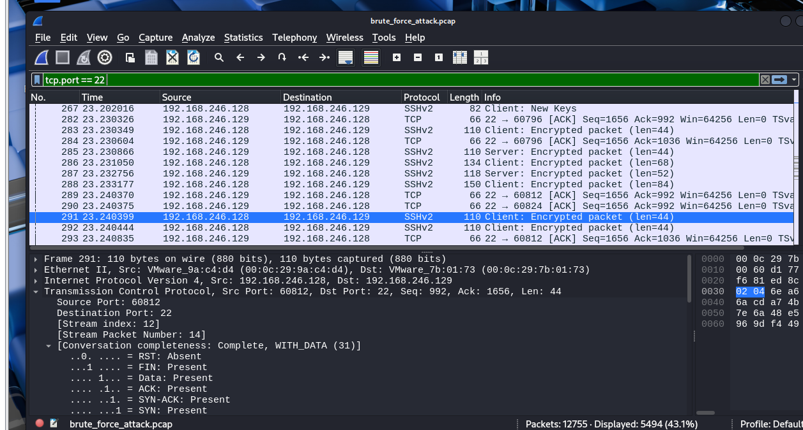
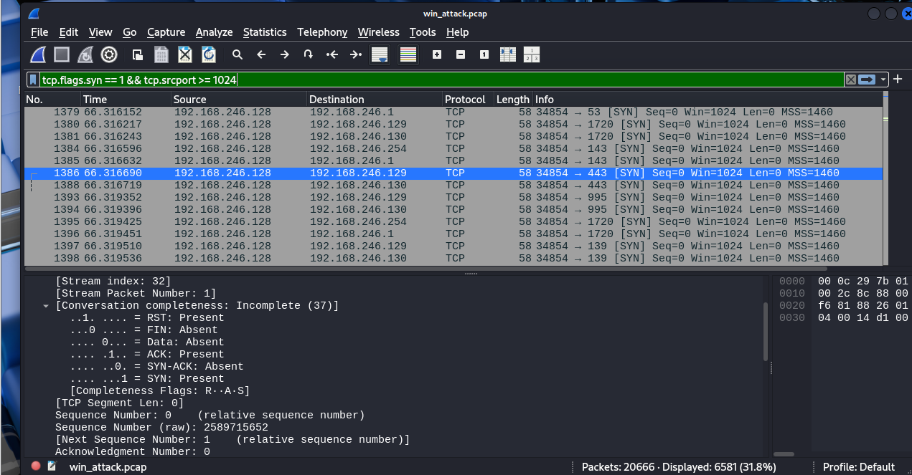
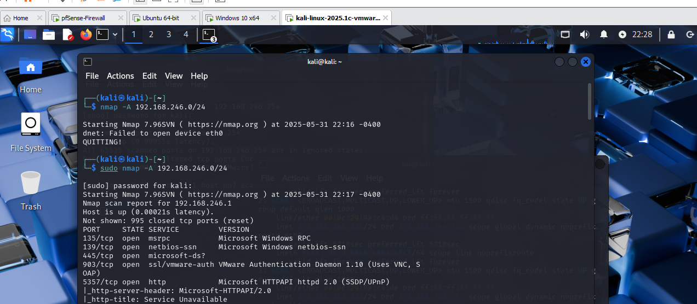

# 🧠 Network Reconnaissance & Threat Detection via Packet Analysis

This project analyzes three real-world reconnaissance techniques using **Wireshark**, **Nmap**, and **Hydra**, captured in a VMware-based home lab. Each scenario is documented with screenshots and technical insights for SOC and blue team operations.

---

## 🎯 Objectives

- Simulate brute-force and scanning techniques using attacker tools
- Analyze packet behavior for different attack types
- Identify patterns of stealth scans, encrypted brute-force, and OS fingerprinting
- Document all activity using Wireshark and Nmap output

---

## 🧪 Lab Environment

| Component     | Purpose                              |
|---------------|---------------------------------------|
| Kali Linux    | Attacker (Hydra + Nmap)              |
| Ubuntu        | Victim (Wireshark + SSH service)     |
| pfSense       | Firewall / packet forwarding         |
| Wireshark     | Installed on Ubuntu for PCAP capture |

---

## 🔐 Scenario 1: SSH Brute-force Attack Detection (Hydra)

### 🧰 Tool Used:
- Hydra

### 🧪 Command:
```bash
hydra -l testuser -P /usr/share/wordlists/rockyou.txt ssh://192.168.246.129
```

### 🔍 Analysis:
- Attacker repeatedly attempts to log in via SSH
- Wireshark shows multiple **encrypted SSHv2 sessions** over TCP port 22
- TCP stream shows: `Complete, WITH_DATA` indicating successful session establishment
- Sign of brute-force is seen in repetitive session initiations and packet length patterns

### 🔎 Wireshark Details:
- Protocol: SSHv2
- Port: TCP 22
- Client: `192.168.246.128 → 192.168.246.129`

### 📸 Screenshot:


---

## 🕵️ Scenario 2: Stealth SYN Scan Detection (Nmap -sS)

### 🧰 Tool Used:
- Nmap

### 🧪 Command:
```bash
nmap -sS -p- 192.168.246.0/24
```

### 🔍 Analysis:
- **SYN packets** sent from attacker with random high source ports
- **No ACKs** returned — results in **incomplete TCP handshakes**
- **RST** response → port closed  
- **No response** → port filtered
- Stealthy behavior designed to avoid triggering IDS/IPS systems

### 🔎 Wireshark Observations:
- Display filter: `tcp.flags.syn == 1 && tcp.flags.ack == 0`
- TCP conversation status: `Incomplete`
- Flags: SYN only, no data, no handshake

### 📸 Screenshot:


---

## 🧭 Scenario 3: Full Service and OS Discovery (Nmap -A)

### 🧰 Tool Used:
- Nmap

### 🧪 Command:
```bash
sudo nmap -A 192.168.246.0/24
```

### 🔍 Analysis:
- OS fingerprinting and service version detection
- Runs multiple scripts to probe target system behavior
- Provides detailed information on open ports, running services, and banner grabs

### 🔎 Example Output:
```
135/tcp   open  msrpc
139/tcp   open  netbios-ssn
445/tcp   open  microsoft-ds
902/tcp   open  VMware Auth Daemon
443/tcp   open  HTTPS
```

### 📸 Screenshot:


---

## 🧠 What I Learned

- How to identify brute-force attempts using encrypted SSH traffic patterns
- How to detect stealth scans via SYN-only packets and incomplete handshakes
- How to correlate Nmap output with actual packet-level behavior in Wireshark
- Practical understanding of how attackers enumerate systems in real networks

